# 🚀 Submit Your MCP Server to MCPScout.ai

Welcome! We're excited that you want to share your MCP server with the community. This guide will walk you through the submission process.

## 📋 Quick Start

**Ready to submit?** Click the button below to get started:

**[➡️ Submit Your Server](https://github.com/mcpscout/servers-to-add/issues/new?template=submit-mcp-server.yml)**

## 🎯 What We're Looking For

We welcome all MCP servers that:

- ✅ Follow the [Model Context Protocol specification](https://modelcontextprotocol.io/)
- ✅ Have clear documentation
- ✅ Are actively maintained or stable
- ✅ Provide value to the AI agent ecosystem

## 📝 Submission Process

### Step 1: Prepare Your Information

Before submitting, gather the following details about your server:

- **Repository URL** - Your GitHub repository link
- **Description** - What does your server do?
- **Installation instructions** - How do users get started?
- **Environment variables** - Any required configuration
- **Tools & Resources** - What capabilities does it provide?
- **Dependencies** - External services or APIs needed

### Step 2: Fill Out the Template

Click the **[Submit Your Server](https://github.com/mcpscout/servers-to-add/issues/new?template=submit-mcp-server.yml)** button and complete the form. The template includes:

| Section | What to Include |
|---------|----------------|
| 🏷️ **Basic Info** | Name, repository URL, description, language |
| 📦 **Installation** | Package names, installation commands |
| ⚙️ **Configuration** | Environment variables, authentication |
| 🛠️ **Capabilities** | Tools, resources, and features |
| 📄 **Metadata** | License, maintenance status |

### Step 3: Submit & Review

1. **Submit** your completed form
2. Our team will **review** your submission (usually within 2-3 days)
3. We may ask for **clarifications** or additional information
4. Once approved, your server will be **added to MCPScout.ai**! 🎉

## ✨ Tips for a Great Submission

> **💡 Pro Tip:** The more detailed your submission, the faster we can review and approve it!

### Make Your Server Stand Out

- **Clear Documentation** - Include a comprehensive README in your repository
- **Examples** - Provide usage examples and sample configurations
- **Testing** - Ensure your server works as expected before submitting
- **Security** - Document any security considerations or best practices
- **Maintenance** - Keep your server updated and respond to issues

### Common Pitfalls to Avoid

- ❌ Missing or incomplete installation instructions
- ❌ Undocumented environment variables
- ❌ No license specified
- ❌ Broken or outdated repository links
- ❌ Untested server implementations

## 🔍 What Happens After Submission?

```mermaid
graph LR
    A[Submit Form] --> B[Team Review]
    B --> C{Approved?}
    C -->|Yes| D[Added to MCPScout.ai]
    C -->|Needs Info| E[Request Clarification]
    E --> B
    D --> F[🎉 Live on Site!]
```

1. **Automated Checks** - We verify the repository exists and is accessible
2. **Manual Review** - Our team evaluates the server's quality and documentation
3. **Testing** - We may test the installation and basic functionality
4. **Approval** - Once approved, your server is added to our database
5. **Publication** - Your server appears on MCPScout.ai within 24 hours

## 📊 Server Categories

Your server will be automatically categorized based on its capabilities:

| Category | Examples |
|----------|----------|
| 🌐 **Web & APIs** | HTTP clients, REST APIs, web scraping |
| 💾 **Data & Storage** | Databases, file systems, cloud storage |
| 🤖 **AI & ML** | LLM integrations, embeddings, AI services |
| 🔧 **Development** | Git, CI/CD, code analysis |
| 📱 **Communication** | Email, chat, notifications |
| 🎨 **Creative** | Image generation, media processing |
| 📈 **Analytics** | Monitoring, logging, metrics |

## 🆘 Need Help?

- **Questions?** Open a [discussion](https://github.com/mcpscout/servers-to-add/discussions)
- **Issues?** Check our [FAQ](https://github.com/mcpscout/servers-to-add/discussions/categories/faq)
- **Feedback?** We'd love to hear from you!

## 📜 Submission Guidelines

### Required Checklist

Before submitting, ensure:

- [ ] Your server follows the MCP specification
- [ ] Repository includes a clear README
- [ ] Installation instructions are tested and working
- [ ] All dependencies are documented
- [ ] You have permission to submit (if not the author)
- [ ] License is clearly specified

### Code of Conduct

We expect all submissions to:

- Be respectful and professional
- Provide accurate information
- Respect intellectual property rights
- Follow open source best practices

## 🌟 Featured Servers

Want your server to be featured? Here's how:

- ⭐ **Quality Documentation** - Comprehensive guides and examples
- 🎯 **Unique Value** - Solve a specific problem well
- 🔒 **Security** - Follow security best practices
- 🚀 **Performance** - Optimized and efficient
- 💬 **Community** - Active maintenance and support

## 🔗 Useful Links

- [MCPScout.ai](https://mcpscout.ai) - Browse existing servers
- [MCP Specification](https://modelcontextprotocol.io/) - Official protocol docs
- [MCP SDK](https://github.com/modelcontextprotocol) - Development tools
- [Community Discord](#) - Join the conversation

---

**Ready to share your server with the world?**

**[🚀 Submit Your Server Now](https://github.com/mcpscout/servers-to-add/issues/new?template=submit-mcp-server.yml)**

Made with ❤️ by the MCPScout.ai team

